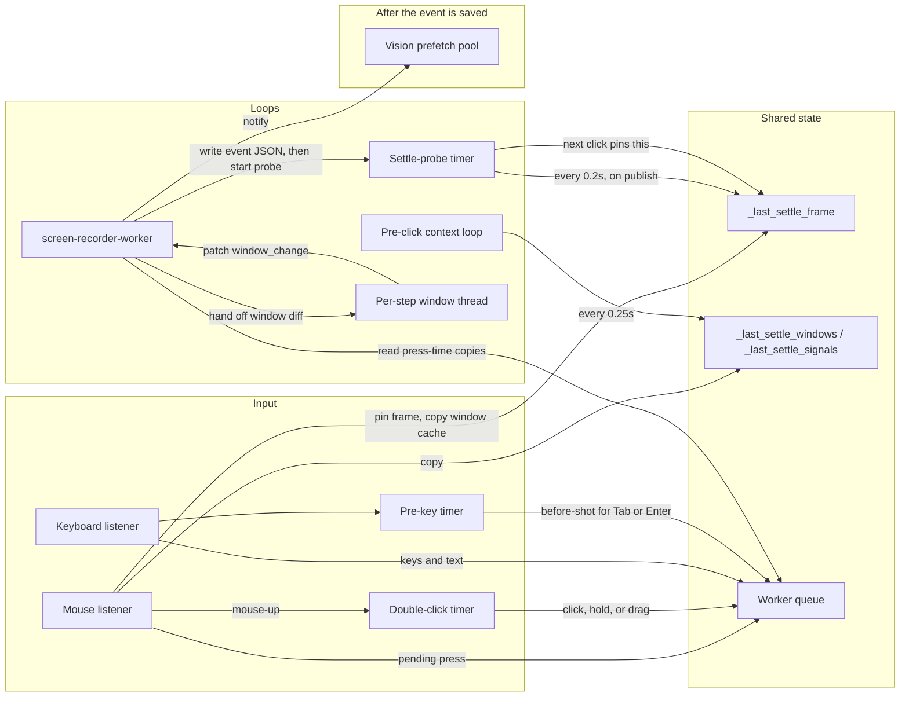
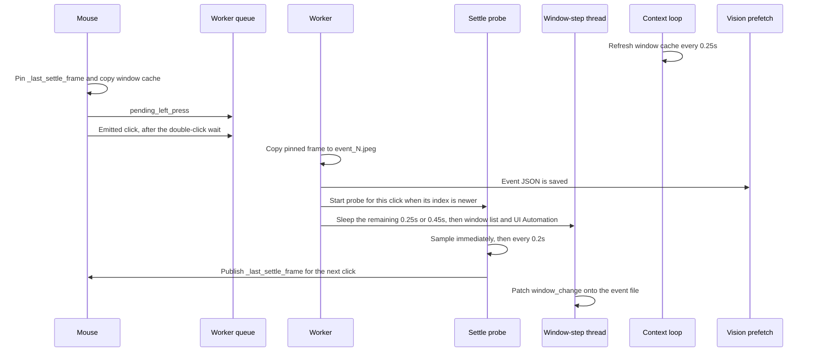

# Recording loops

What runs while a session is being recorded, and how a click moves between them. All of this lives in `src/recorder/capture.py` unless noted.

## Threads

## Shared state

| Name | Written by | Read by |
| --- | --- | --- |
| `_last_settle_frame` | Settle-probe timer, when a sample is published | Mouse hook, which pins it as the next step's screenshot |
| `_last_settle_windows`, `_last_settle_signals` | Pre-click context loop | Mouse hook, copied at press time and stored with that click |
| Worker queue | Mouse hook, keyboard hook, both timers | `screen-recorder-worker`, one job at a time |
| `_settle_probe` | Worker, immediately after the event JSON is written | Settle-probe timer. A start replaces the slot only when its event index is newer |

## Loops

### Settle-probe timer

One slot. Recording starts it as event 0 so the first click has a frame to pin. After each recorded click, drag, hold, text input, or key press, the worker replaces that slot.

The first sample is immediate. Later samples wait 0.2 seconds (`_SETTLE_PROBE_INTERVAL_S`), up to 55 seconds. Two similar samples stop the probe. Each published sample is copied to `screenshots/_settle_pub_NNNNN.jpeg` and stored as `_last_settle_frame`. The probe timer does not enumerate windows. The context loop owns that cache.

The frame pinned by the next click is this step's after shot and the next step's before shot.

### Pre-click context loop

Thread `screen-recorder-preclick-context`. Every 0.25 seconds (`_PRE_CLICK_CONTEXT_INTERVAL_S`) it refreshes the window list and the fast signals. Clipboard and UI Automation are refreshed at most once a second on this same thread, so a stall here does not block the probe timer.

The mouse hook copies this cache at press time. It does not enumerate windows itself.

### screen-recorder-worker

Thread `screen-recorder-worker`. One queue, one job at a time. The first job seeds the window list so the context loop can start.

For a click the queue holds two jobs: `pending_left_press` (copy the pinned frame into `_pending_capture_{press_seq}.jpeg`, then into the before shot) and, after mouse-up, the emitted click. Persisting that click writes the event JSON, notifies the hub, and starts the settle probe. It does not sleep and it does not call UI Automation.

Each press has its own pending file so two presses cannot share `_pending_capture.jpeg`.

### Per-step window thread

After the event file exists, the worker starts `window-step-N`. That thread sleeps only the remainder of the settle delay measured from the gesture: 0.25 seconds normally, 0.45 seconds for a title-bar click. It then enumerates windows and runs UI Automation with a 1 second timeout. On timeout it leaves `window_change` empty. Otherwise it patches `window_change`, `target_window_title`, and `window_snapshot_debug` into the event JSON.

`finalize_stop` joins these threads for up to 2 seconds before it writes `session.json`. A slow step stays on its own thread, so the next click's probe can start while this one is still in UI Automation. A late thread cannot replace a newer probe, because `_start_settle_probe` ignores an event index that is not newer than the probe already running.

### Vision prefetch pool

`recording-vision-prefetch` in `src/recorder/vision_prefetch.py`. The hub's `_on_recording_event` enqueues the saved event. YOLO and OCR run here and do not block the worker. In the 05:52 session, step 1's prefetch was still running when step 4's probe started.

### One-shot timers

These are not loops. They are how input reaches the worker.

| Timer | Delay | What it does |
| --- | --- | --- |
| Double-click | Up to 0.35 seconds after mouse-down | Mouse-up schedules it. It then enqueues the click, or a hold or drag. A second press at the same spot emits a double-click instead. |
| Pre-key | 0.3 seconds after typing pauses | Enqueues a before-shot so the next Tab or Enter can reuse a settled frame. The low-level hook cannot grab the screen before that key is delivered. |
| Clipboard | Join 0.25 seconds | A short thread inside a signal refresh. If the clipboard owner blocks, the caller continues without text. |

### Stop

`_finish_settle_against_final_after` replaces the probe timer. It captures the full desktop until the sample matches `final_after.jpeg` or 55 seconds pass.

## One click

## Why the probe used to miss the search panel

Step 3 was a title-bar close. The worker used to sleep and call UI Automation before it was allowed to start the next probe. Step 5 clicked while that work was still running, and it pinned a frame from before the search panel opened. The window-step thread is what keeps that work off the probe.
