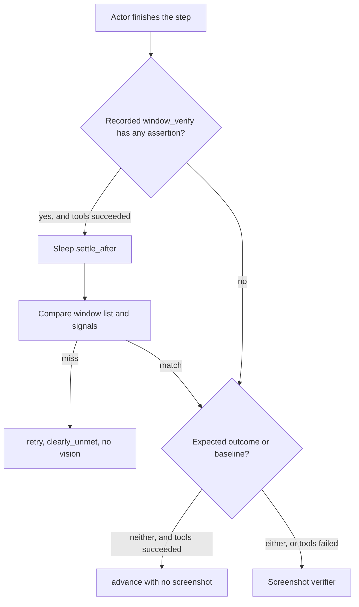

# Verification points

What a replay step can check, and where each value comes from. Window and signal checks live in `src/recorder/window_snapshot.py` and `src/recorder/verify_signals.py`. The step order lives in `BrainModule.process_step` in `src/brain/module.py`.

A missing field asserts nothing. Extra live window changes are ignored. A recorded field must match the live after-sample.

## When a step is checked

`settle_after` is the gap until the next recorded event when that gap is at least 1 second. Window verify sleeps that full gap once. A baseline with no window predicate polls the screenshot at 1.0×, 1.5×, and 2.0× of the gap (1.0× only when the gap is under 2 seconds).

## Where the recorded predicate comes from

Recording stores two samples on `window_snapshot_debug`, then `window_verify_from_debug` writes `analysis/event_NNN.json` → `window_verify`. Replay loads that dict through `collect_recording_window_verifies`.

| Sample | When | What fills it |
| --- | --- | --- |
| Before | Copied from the pre-click context cache at the gesture | `screen-recorder-preclick-context`. Every 0.25 seconds: top-level windows, foreground, caret. At most once a second: clipboard, process names, UI Automation. |
| Press-time point | On the mouse hook, at the click coordinates | `WindowFromPoint` + `GetAncestor(GA_ROOT)`. This overwrites `signals_before.point_window`. It is also the `click_window` passed to `move_mouse`. |
| After | Window-step thread, after the remaining 0.25 seconds (0.45 seconds for a title-bar click). A text step flushed by the next click or key uses the settle cache copied on the hook before that gesture, so the gesture's window change stays on the gesture. | A fresh top-level window list, then `capture_step_signals` at the same cursor. UI Automation runs only for a click, text input, or scroll, with a 1 second timeout. On timeout the patch is skipped. The sealed text after-sample skips that live read. |

`signal_verify_fields` keeps only values that changed. The stored value is the after-sample.

## Window list

`snapshot_top_level_windows` enumerates visible top-level windows and fills each window's executable name from one process snapshot. `appeared`, `disappeared`, and `state` store that name with the class name. Recording still pairs a window with itself by hwnd, and same-identity hwnd churn uses class, normalized title, and process name. Replay of those three compares class name and process name only. Title is stored for display and is not compared, because it can differ on the next run. A blank recorded class or process matches any live value. An entry with neither does not match. The agent hub window (`電腦使用代理`), the taskbar, and the input-pane strip (`EdgeUiInputTopWndClass`) are dropped. Replay skips those classes when an older analysis still lists them. A title change on an hwnd that is still present is not an appear or disappear.

| Point | Recorded when | Replay read |
| --- | --- | --- |
| `appeared` | An hwnd is in the after list and was not in the before list. Taskbar, the input-pane strip, and the agent hub are dropped. Same-identity hwnd churn cancels out. | The window must be present in the live after list. It does not need to newly appear during the step. |
| `disappeared` | An hwnd was in the before list and is gone after. Taskbar, the input-pane strip, and the agent hub are dropped. | The window must be absent from the live after list. It does not need to have been open before the step. |
| `state` | The same hwnd is still there and `is_minimized` or `is_maximized` flipped. Label is `minimized`, `restored`, `maximized`, or `unmaximized`. | The matching window must be present in the live after list and already hold that end flag (`maximized` → `is_maximized`, `minimized` → `is_minimized`, `restored` → not minimized, `unmaximized` → not maximized). It does not need to flip during the step. |

Replay takes the before list at the start of the step and the after list after `settle_after`.

## Signals

Replay reads a signal only when the recorded predicate contains that field (`capture_replay_after_signals`). `foreground` and `click_window` match on class name and process name. Title is not compared. A blank recorded class or process matches any live value. An entry with neither does not match.

| Point | Recorded when | How the after value is read | Replay read |
| --- | --- | --- | --- |
| `foreground` | `GetForegroundWindow` changed, and the after window is not the agent hub. Omitted when `appeared`, `disappeared`, or `state` is also present (next-focus after those changes is ignored on replay too). | `GetForegroundWindow`, then class, title, and the executable name of that hwnd's process. | Same call after the step. A live agent-hub foreground fails. |
| `click_window` | Click, double-click, triple-click, right-click, or middle-click, and the root window under the cursor changed between press and settle. The stored identity is the **press-time** window, including its executable name. | `WindowFromPoint` on the mouse hook at the click, then the executable name of that process, saved as `signals_before.point_window`. | The click tool calls `window_at_point` at the click coordinates before the button goes down. Verification uses that identity and does not read the cursor again after settle. |
| `clipboard` | Clipboard text changed. | `pyperclip.paste`, giving up after 0.25 seconds. Text is cut at 4000 characters. | Same read. Compared as an exact string. |
| `process_started` | A process name is in the after Toolhelp snapshot and was not in the before snapshot, and a new top-level window does not already explain it. | `CreateToolhelp32Snapshot`. Names on a top-level window go in `pid_names`. A user-session process with no window goes in `orphan_processes`. Service and shell hosts such as `svchost.exe` and `SearchHost.exe` are left out. | The live name must be in `pid_names` or `orphan_processes`. |
| `process_exited` | A name left that set, and a closed window does not already explain it. | Same snapshot. | The live name must be absent. |
| `caret` | Text input, and the caret window changed: a different hwnd, or the caret appeared. Movement inside the same hwnd is omitted. The field is omitted unless both the class name and the executable name were read. | `GetGUIThreadInfo` on the foreground thread for `hwndCaret`, then `GetClassNameW` and the executable file name of that window's process. The stored value is those two names. | The live caret window's class name and executable file name must both match. Screen position is not compared. |
| `focused` | Text input, and the focused element's name or value changed. A name equal to the foreground title is ignored. A value that is neither equal to the typed text nor a prefix of it (or the reverse) is omitted: an address bar can report a fragment that is not the text the step types. | UI Automation `GetFocusedElement`: current name, and the value pattern when present. | Exact `name`. `value` matches when the strings are equal, or one is a prefix of the other, so an inline-autocomplete tail on either side still passes. |
| `scroll` | A scroll, and the percent moved by more than 0.5. Stored to one decimal. | UI Automation element at the cursor, walking up to 8 parents, from the range-value pattern: `(value - min) / (max - min) * 100`. | Within 5 percent. |

`control_state` may still appear in recorded `signals_before` / `signals_after` for debugging. It is not written into `window_verify` and is ignored if an older analysis still has it.

## Screenshot

These run only when window verify did not already fail. They are skipped when the tools succeeded and both are empty.

| Point | Recorded when | Replay read |
| --- | --- | --- |
| Expected outcome | `analysis/event_NNN.json` has `use_expected_outcome` true and non-empty `expected_outcome` text. Older files with text and no flag stay on. | The verifier LLM sees a fresh screenshot and that sentence. `clearly_unmet` is true only when the sentence is visibly contradicted. After a successful actor, an uncertain retry is coerced to advance. |
| Baseline after | The recording after-frame for that step: the next event's before shot, or the typing/drag end shot, or `screenshots/final_after.jpeg`. The path is kept even when the outcome checkbox is off, so the report can show it. Vision uses it when the checkbox is on. | The verifier LLM compares the live screenshot to that image. A match, or a low-confidence mismatch, advances. A high-confidence mismatch continues into recovery. |
